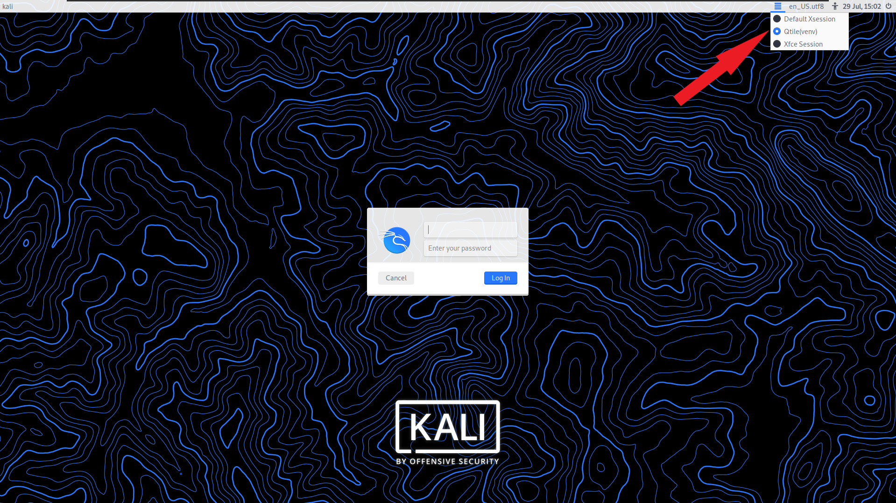

# Qtile — Personal Tiling Window Manager Config

A complete, batteries-included [Qtile](https://qtile.org/) configuration for X11: multi-monitor aware, Nerd Font powerline bar, media/brightness keys, and a custom widget to mirror and control an Android phone over wireless ADB + scrcpy.

> Built and tested on Ubuntu 24.04.4 LTS with Python 3.12 and Qtile 0.36.0.



---

## Features

- **Modular config** — keys, groups, layouts, screens, hooks, and widgets live in separate files under `src/modules/`.
- **Dynamic multi-monitor** — screens are detected at startup via `xrandr`; monitor order is configurable by serial or port.
- **11 layouts** — MonadTall, MonadWide, Max, Tile, Stack, TreeTab, Matrix, and more.
- **Powerline status bar** — system updates, crypto ticker, CPU/GPU temps, memory, network, clock, and a system tray.
- **Phone mirroring widget** — start/stop scrcpy, reconnect ADB, and control phone volume straight from the bar.
- **`.env`-driven** — runtime behavior (monitor ordering, phone mirror) is configured through environment variables, not hardcoded.
- **Reproducible deps** — locked with `pip-tools`; linted and type-checked with `ruff` and `mypy`.

---

## Requirements

- An **X11** session (this config targets the X backend, not Wayland).
- **Python 3.12+**.
- A **Nerd Font** installed — the bar uses `CaskaydiaCove Nerd Font`. Grab it from [nerdfonts.com](https://www.nerdfonts.com/).
- A display manager that reads `/usr/share/xsessions/` (LightDM, GDM, SDDM, etc.).

---

## Quick start

This config is designed to live at `~/.config/qtile`.

```bash
git clone https://github.com/vaayroon/qtile.git ~/.config/qtile
cd ~/.config/qtile
./install.sh
```

`install.sh` creates the virtual environment, installs dependencies, sets up
`.env` from the template, and registers the X session entry (the X session step
prompts for `sudo`). Then **log out and pick "Qtile (venv)"** from your display
manager.

Useful flags:

| Flag | Effect |
|---|---|
| `--dev` | Also install dev dependencies (`ruff`, `mypy`, `pip-tools`). |
| `--force` | Recreate the virtual environment from scratch. |
| `--skip-xsession` | Don't touch `/usr/share/xsessions` (no `sudo`). |

> The script is re-runnable: an existing `.venv` and `.env` are left untouched
> unless you pass `--force`.

### Manual setup

Prefer to do it by hand? The steps the script performs:

```bash
python3.12 -m venv .venv                     # 1. virtual environment
.venv/bin/pip install -r requirements.txt    # 2. runtime dependencies
cp .env.example .env && $EDITOR .env         # 3. configure
```

Then register the session by creating `/usr/share/xsessions/qtile-venv.desktop`:

```ini
[Desktop Entry]
Name=Qtile (venv)
Comment=Qtile Session
Type=Application
Keywords=wm;tiling
Path=/home/YOUR_USER/.config/qtile
Exec=/home/YOUR_USER/.config/qtile/.venv/bin/qtile start -c /home/YOUR_USER/.config/qtile/src/config.py
```

> ⚠️ Replace `YOUR_USER` with your username. `Exec` and `Path` must be absolute —
> the display manager does not expand `~`. `Path` sets the working directory so
> `.env` is loaded; without it your configuration is silently ignored.

### Try it without logging out

Test the config in a nested X server with [Xephyr](https://wiki.archlinux.org/title/Xephyr):

```bash
sudo apt install xserver-xephyr
Xephyr -br -ac -noreset -screen 1280x720 :1 &
DISPLAY=:1 .venv/bin/qtile start -c src/config.py
```

---

## Configuration

Runtime behavior is controlled through `.env` (loaded by `python-dotenv` at startup). Copy `.env.example` and adjust:

### Monitors

| Variable | Default | Purpose |
|---|---|---|
| `QTILE_SCREEN_SERIAL_ORDER` | _(empty)_ | Comma-separated monitor serials, highest priority for ordering. |
| `QTILE_SCREEN_PORT_ORDER` | `DP-0,HDMI-0,DP-2` | Port-name fallback order when serials are missing. |
| `QTILE_INTERNAL_OUTPUTS` | `eDP-1` | Outputs treated as the internal laptop panel. |
| `QTILE_PRIMARY_MONITOR` | _(empty)_ | Force a specific output to be `--primary`. |

### Phone mirroring

| Variable | Default | Purpose |
|---|---|---|
| `QTILE_PHONE_MIRROR_WIRELESS_TARGET` | _(empty)_ | ADB wireless target, e.g. `192.168.1.15:5555`. |
| `QTILE_PHONE_MIRROR_DEVICE` | _(empty)_ | Fixed ADB serial (empty = first device found). |
| `QTILE_PHONE_MIRROR_ADB_PATH` | `/opt/genymobile/adb` | Path to the `adb` binary. |
| `QTILE_PHONE_MIRROR_SCRCPY_PATH` | `scrcpy` | Path to the `scrcpy` binary. |
| `QTILE_PHONE_MIRROR_SCREEN_OFF` | `true` | Start scrcpy with the phone screen off (`-S`). |
| `QTILE_PHONE_MIRROR_SHOW_DEVICE` | `false` | Append the device serial to the bar status text. |
| `QTILE_PHONE_MIRROR_VOLUME_STEP` | `5` | ADB volume key-events sent per scroll tick. |

### Appearance

Colors, borders, fonts, and the terminal are defined in [`src/settings.py`](src/settings.py):

- **Mod key**: `Super` (Windows key).
- **Borders**: 2px, focused `#117af0`, normal `#1D2330`, 6px gaps.
- **Bar font**: `CaskaydiaCove Nerd Font`, size 12.

---

## Keybindings

`mod` = `Super` (Windows key).

### Windows & layouts

| Keys | Action |
|---|---|
| `mod + Tab` | Cycle to next layout |
| `mod + j` / `mod + k` | Move focus up / down the stack |
| `mod + Shift + j` / `mod + Shift + k` | Shuffle window up / down |
| `mod + h` / `mod + l` | Grow / shrink window (or adjust master count) |
| `mod + n` | Normalize window sizes |
| `mod + m` | Toggle maximize |
| `mod + Shift + f` | Toggle floating |
| `mod + Shift + m` | Toggle fullscreen |
| `mod + space` | Switch focus between stack panes |
| `mod + Shift + space` | Flip the main pane side |
| `mod + Ctrl + Return` | Toggle split / unsplit |
| `mod + Shift + c` | Close window |
| `mod + Shift + r` | Reload config |
| `mod + Shift + q` | Quit Qtile |

### Groups (workspaces)

| Keys | Action |
|---|---|
| `mod + 1…7` | Switch to group |
| `mod + Shift + 1…7` | Move focused window to group |

### Monitors

| Keys | Action |
|---|---|
| `mod + w` / `mod + e` / `mod + r` | Focus monitor 1 / 2 / 3 |
| `mod + period` / `mod + comma` | Focus next / previous monitor |

### Launchers

| Keys | Action |
|---|---|
| `mod + Return` | Terminal (`kitty`) |
| `mod + Shift + Return` | `dmenu` run prompt |
| `Menu` | App launcher (`rofi`) |
| `mod + Alt + <key>` | Quick-launch apps (browser, files, editor, Spotify, screenshots…) |

### Media, audio & brightness

| Keys | Action |
|---|---|
| `XF86AudioRaise/Lower/Mute` | Volume via `pamixer` |
| `XF86AudioPlay/Next/Prev/Stop` | Playback via `playerctl` |
| `XF86MonBrightnessUp/Down` | Brightness via `brightnessctl` |
| `Ctrl + Alt + l` | Lock screen (`i3lock`) |

> The full, authoritative list lives in [`src/modules/keys.py`](src/modules/keys.py).

---

## The status bar

Left to right, the bar shows: group box → window name → available updates → BTC/EUR ticker → CPU & GPU temps → memory → network → **phone mirror** → clock → current layout → system tray (primary monitor only).

### Phone mirror widget

A custom widget ([`src/widgets/phone_mirror.py`](src/widgets/phone_mirror.py)) that controls scrcpy from the bar:

| Interaction | Action |
|---|---|
| **Left click** | Start / stop mirroring |
| **Right click** | Force wireless ADB reconnect |
| **Middle click** | Toggle "phone screen off" mode |
| **Scroll up / down** | Phone volume up / down |

Status text: `PHONE:READY` (connected, idle) · `PHONE:MIRROR` (running) · `PHONE:DISC` (no device) · `PHONE:ERR` (adb/scrcpy not found). If a binary is missing it opens a `zenity`/`tkinter` dialog to fix paths and targets on the fly.

---

## External tools

The config spawns external programs for keybindings, the bar, and widget click actions. Install the ones you use.

**Core (recommended):**

```bash
sudo apt install kitty rofi suckless-tools pamixer playerctl \
  brightnessctl i3lock flameshot x11-xserver-utils
```

**Status bar & autostart helpers:**

```bash
sudo apt install lm-sensors htop glances \
  cbatticon volumeicon-alsa udiskie network-manager-gnome blueman
```

**Phone mirroring:** [`adb`](https://developer.android.com/tools/adb) and [`scrcpy`](https://github.com/Genymobile/scrcpy) (the config expects them under `/opt/genymobile/`; override via `.env`).

Other optional integrations referenced in keybindings: `nautilus`, `pavucontrol`, `psensor`, `cointop`, `gnome-calendar`, `brave-browser`, `code-insiders`, `spotify`, and remote-desktop clients. None are required — unbound tools simply do nothing when their key is pressed.

---

## Development

Dependencies are declared in **`pyproject.toml`** (the single source of truth)
and locked to exact versions with [`pip-tools`](https://github.com/jazzband/pip-tools).
The `requirements*.txt` files are **generated lock files** — never edit them by
hand.

```bash
.venv/bin/pip install -r requirements-dev.txt   # ruff, mypy, pip-tools

# Re-compile the lock files after editing dependencies in pyproject.toml
pip-compile pyproject.toml -o requirements.txt
pip-compile --extra dev pyproject.toml -o requirements-dev.txt

# Lint, format, type-check
ruff check src/
ruff format src/
mypy src/
```

---

## Project structure

```
src/
├── config.py        # Qtile entry point — assembles everything
├── settings.py      # Mod key, terminal, colors, fonts, layout theme
├── modules/         # groups · hooks · keys · layouts · mouse · screens · widgets
├── widgets/         # Custom widgets (PhoneMirrorWidget)
└── utils/           # colors · network · system helpers
pyproject.toml       # Project metadata + dependency declarations (source of truth)
.env.example         # Template for runtime configuration
requirements*.txt    # Generated pip-tools lock files
install.sh           # Bootstrap script (venv, deps, .env, X session)
.screenshots/        # README assets
```

---

## License

Personal configuration — use it, fork it, adapt it freely.
